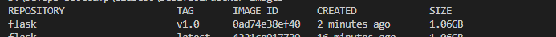
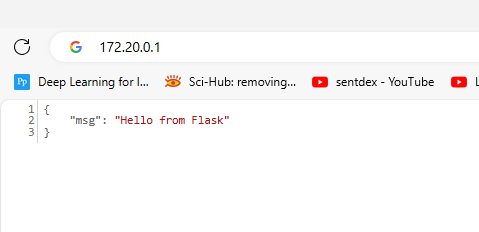

1. Comenzamos con la creacion de una basica app en flask, la cual permite hacer un GET y recibir un mensaje mediante una pagina web.
                        from flask import Flask, jsonify

                        app = Flask(__name__)

                        @app.route("/", methods=["GET"])
                        def say_hello():
                            return jsonify({"msg": "Hello from Flask"})

                        if __name__ == "__main__":
                            # Please do not set debug=True in production
                            app.run(host="0.0.0.0", port=5000, debug=True)

2. Creamos un dockerfile, en donde colocaremos la imagen a utilizar "python:3.9", se van a copiar los elementos app.py y requirements.txt para configurar el container.

                            FROM python:3.9

                            COPY . .

                            # set environment variables
                            ENV PYTHONDONTWRITEBYTECODE 1
                            ENV PYTHONUNBUFFERED 1

                            EXPOSE 5000
                            RUN pip install --upgrade pip
                            RUN pip install --no-cache-dir -r requirements.txt

                            ENV FLASK_APP=app.py
                            CMD ["flask", "run", "--host", "0.0.0.0"]
3. Hacemos un docker build para crear la imagen del mismo

4. Una vez que la imagen esta creada procedemos a probar la misma. Para ello ejecutamos docker run -p 5000:5000 "imagen"

