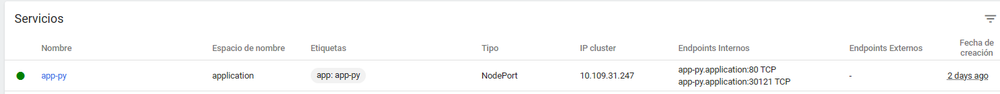
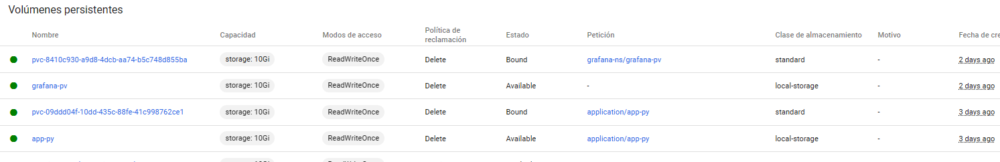
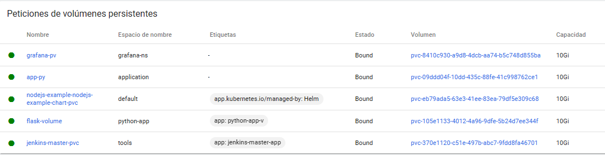
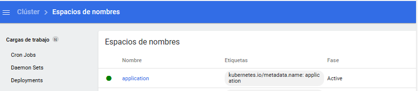
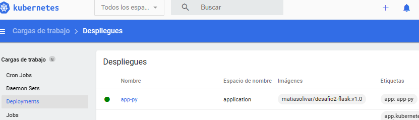
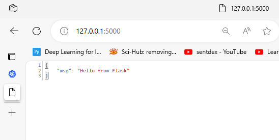

1. Se hace un deployment utilizando a minikube como clster de kubernetes
2. Inicializamos minikube con el comando minikube start y procedemos a inicializar el dashboard con minikube dashboard

3. Para este desafio se utiliza una aplicacion en python. La imagen de la misma es creada mediante el pipeline creado en github actions
4. Creamos los siguientes manifiestos para la creacion del depolyment.
    a. deployment.yaml: con la configuracion del mismo, cantidad de replicas y volumenes
    b. svc.yaml: configuracion de los puertos necesarios para conectar con la app utilizando http
    c. pv.yaml: para este desafio se utiliza un persitent volume, aqui indicamos la configuracion, espacio y path
    d. pvc.yaml: se realiza el claim para con el persistent volume.
    e. ns.yaml: Para este deployment se creo un namespace especifico

5. Procedemos a ejecutar los manifiestos utilizando el comando kubectl apply -f manifest.yaml
    a.kubectl apply -f ns.yaml
    b.kubectl apply -f svc.yaml
    c.kubectl apply -f pv.yaml
    d.kubectl apply -f pvc.yaml
    e.kubectl apply -f deployment.yaml

6. Deberiamos poder ver en el dashboard los servicios creados
    svc.yaml
    

    pv.yaml
    

    pvc.yaml
    

    ns.yaml

    deployment.yaml

7. Exponemos el puerto del servicio en el puerto 5000
    kubectl port-forward service/app-py-svc -n application 5000:5000
8. Acceso a 127.0.0.1:5000

Entonces se desplego un deployment en minikube, utilizando la pipeline creada en github actions para crear la imagen de la app.